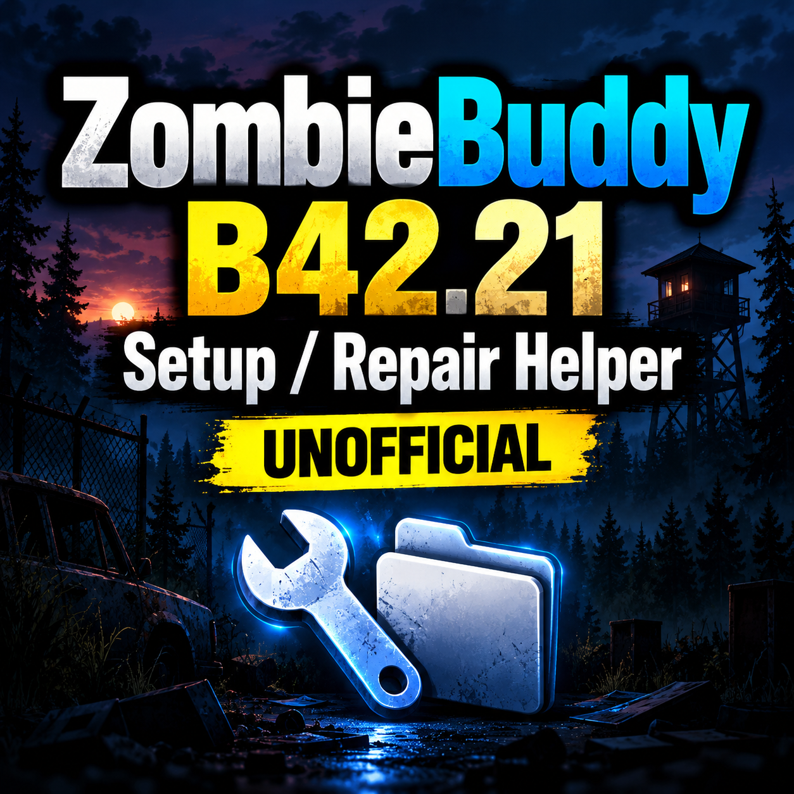

<p align="center">
  
</p>

# ZombieBuddy Windows Setup / Repair Helper

> **Unofficial community tool for Project Zomboid on Windows**

This is an independent PowerShell setup and repair helper for **ZombieBuddy**.

It was created to make the Windows installation process easier for players who have had trouble locating the correct Steam Workshop folders, installing ZombieBuddy's required files, or applying the temporary compatibility fix for Project Zomboid Build 42.21.

## Safety and transparency

This helper is provided as readable PowerShell source code so you can inspect every action before running it.

It does **not** download or execute files from the internet. It only works with files that Steam Workshop has already downloaded to your computer.

You are encouraged to review the script before running it.

## Important

This helper is **not ZombieBuddy** and is **not a replacement for ZombieBuddy**.

### Original ZombieBuddy

- Author: **Zed**
- Steam Workshop ID: `3619862853`
- Workshop: [ZombieBuddy](https://steamcommunity.com/sharedfiles/filedetails/?id=3619862853)

Files located and copied by this helper:

- `ZombieBuddy.jar`
- `zbNative.dll`

### Temporary B42.21 Compatibility Patch

- Author: **Kaoeutsu**
- Steam Workshop ID: `3809837933`
- Workshop: [Temporary B42.21 Compatibility Patch](https://steamcommunity.com/sharedfiles/filedetails/?id=3809837933)

File located and copied by this helper:

- patched `ZombieBuddy.jar`

The compatibility patch does **not** replace `zbNative.dll`.

## What this helper does

The helper can:

- Automatically locate Steam.
- Detect Steam Library folders.
- Locate the Project Zomboid installation.
- Locate Zed's ZombieBuddy Workshop files.
- Locate `ZombieBuddy.jar`.
- Locate `zbNative.dll`.
- Locate Kaoeutsu's temporary B42.21 compatibility patch.
- Locate the patched `ZombieBuddy.jar`.
- Diagnose an existing installation without changing anything.
- Install or repair the base ZombieBuddy files.
- Apply the temporary B42.21 replacement JAR.
- Create backups before replacing existing files.
- Verify copied files using SHA-256.
- Check for the required Steam launch option.
- Check whether `mod_approvals.json` exists.
- Create a diagnostic log for troubleshooting.

## What this helper does NOT do

This helper:

- **DOES NOT** download ZombieBuddy.
- **DOES NOT** download the B42.21 compatibility patch.
- **DOES NOT** contain `ZombieBuddy.jar`.
- **DOES NOT** contain `zbNative.dll`.
- **DOES NOT** contain Kaoeutsu's patched `ZombieBuddy.jar`.
- **DOES NOT** redistribute either author's files.
- **DOES NOT** claim ownership of either author's work.
- **DOES NOT** alter the contents of their files.
- **DOES NOT** modify `projectzomboid.jar`.
- **DOES NOT** delete Project Zomboid game folders.
- **DOES NOT** automatically modify your save/mod list.
- **DOES NOT** automatically change your Steam launch options.
- **DOES NOT** download anything from the internet.

It only locates, backs up, and copies files that Steam Workshop has already downloaded to the user's computer.

## Requirements

- Windows
- Steam version of Project Zomboid
- Original ZombieBuddy by Zed — Workshop ID: `3619862853`
- Temporary B42.21 compatibility patch by Kaoeutsu — Workshop ID: `3809837933`

Steam must have finished downloading the required Workshop items before the helper can use their files.

## How to use

1. Subscribe to the original [ZombieBuddy](https://steamcommunity.com/sharedfiles/filedetails/?id=3619862853) Workshop item.
2. Subscribe to Kaoeutsu's [temporary B42.21 compatibility patch](https://steamcommunity.com/sharedfiles/filedetails/?id=3809837933).
3. Allow Steam to finish downloading both Workshop items.
4. Close Project Zomboid.
5. Download `ZombieBuddy-Windows-Setup-Repair-Helper.ps1` from this repository.
6. Open PowerShell. For installation or repair actions, run PowerShell as Administrator.
7. In PowerShell, go to the folder containing the helper and run:

```powershell
powershell -ExecutionPolicy Bypass -File ".\ZombieBuddy-Windows-Setup-Repair-Helper.ps1"
```

## Helper menu

The helper provides the following options:

### 1. Diagnose installation only (NO CHANGES)

Checks the installation without modifying any files.

### 2. Install / repair base ZombieBuddy

Locates and installs Zed's:

- `ZombieBuddy.jar`
- `zbNative.dll`

### 3. Apply temporary B42.21 patch

Backs up the currently installed `ZombieBuddy.jar` and replaces only that file with the patched JAR.

`zbNative.dll` is not changed.

### 4. Full setup: base ZombieBuddy + B42.21 patch

Performs the complete setup in the correct order:

1. Back up existing ZombieBuddy files.
2. Install Zed's original ZombieBuddy files.
3. Verify the copied files.
4. Back up the original JAR.
5. Install the temporary B42.21 patched JAR.
6. Verify the patched JAR.

### 5. Show required launch option / final checklist

Displays the remaining setup information.

## Steam launch option

For the standard Windows setup, the required launch option is:

```text
-agentlib:zbNative --
```

The trailing `--` is required.

## Backups and verification

Before replacing existing files, the helper creates timestamped backup copies.

Copied files are verified using SHA-256 so the destination file can be checked against the source file.

The helper does not automatically delete its backups.

## Java mod approvals

ZombieBuddy uses:

```text
mod_approvals.json
```

to store previous Java-mod allow / deny decisions.

This file does not make ZombieBuddy detect a JAR that the loader cannot see.

The helper checks for this file for diagnostic purposes but does not create or modify it.

## Credits and ownership

**ZombieBuddy**  
Created by **Zed**  
Steam Workshop ID: `3619862853`

**Temporary B42.21 Compatibility Patch**  
Created by **Kaoeutsu**  
Steam Workshop ID: `3809837933`

**Project Zomboid**  
Created by **The Indie Stone**

This PowerShell helper was created independently as an unofficial community utility.

It is not affiliated with, endorsed by, or an official release from Zed, Kaoeutsu, or The Indie Stone.

This repository does not contain or redistribute ZombieBuddy or the temporary compatibility patch, and no ownership of those projects or their files is claimed.

## Source code

The PowerShell script in this repository is provided in readable source form so users can inspect exactly what it does before running it.

## Current status

This helper was created for the Project Zomboid Build 42.21 compatibility situation.

If ZombieBuddy or the temporary compatibility patch changes in a future update, this helper may also need to be updated.

If an official ZombieBuddy update removes the need for the temporary B42.21 compatibility patch, the temporary patch workflow should no longer be used.

## License

The helper itself is released under the MIT License. See the [`LICENSE`](LICENSE) file.

The MIT License applies only to this independently created helper project. It does not grant any rights to ZombieBuddy, the compatibility patch, Project Zomboid, or files belonging to their respective creators.
